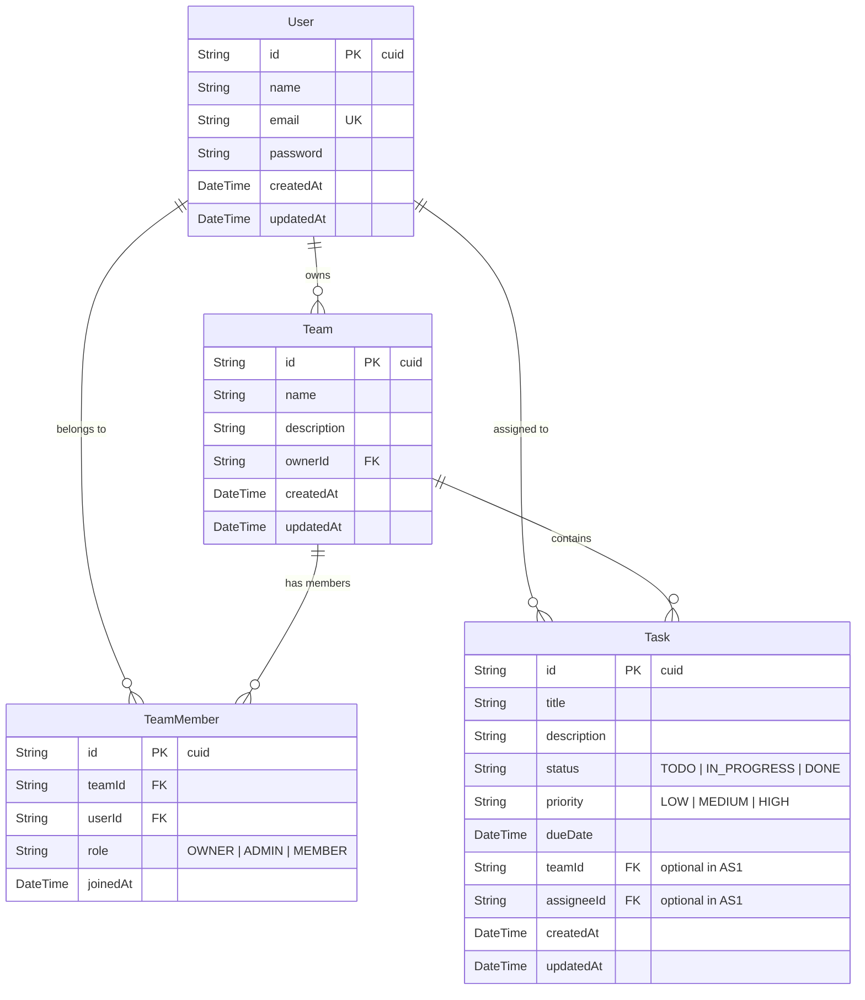

# TaskSync – Task & Team Management Application (Assignment 1)

> **Course**: SDN302 – Web Development with Next.js & Cloud Databases  
> **Student Assignment**: Assignment 1 – Project Setup, Prisma & Deployment  
> **Deployment Platform**: Vercel  
> **Database**: Supabase PostgreSQL  
> **ORM**: Prisma ORM  

---

## 📌 Project Overview

**TaskSync** is a modern task and team management web application built with **Next.js App Router**, **TypeScript**, **Tailwind CSS**, and **Prisma ORM** connected to a cloud **PostgreSQL database hosted on Supabase**.

In this foundational phase (Assignment 1), the application provides:
- **Full Public CRUD** for tasks without requiring authentication.
- **RESTful API Route Handlers** (`GET`, `POST`, `PUT`, `DELETE`).
- **Prisma Data Modeling** with complete schemas for `User`, `Team`, `TeamMember`, and `Task`.
- **Responsive & Modern UI** with search, status filtering, and real-time list updates.
- **CI/CD pipeline** via GitHub Actions.
- **Deployment readiness** for Vercel.

---

## 🏗️ Entity Relationship Diagram (ERD)

The initial Prisma schema models users, teams, memberships, and tasks, preparing the codebase for Assignments 2 and 3:



---

## 🛠️ Tech Stack & Folder Structure

### Technologies
- **Framework**: [Next.js](https://nextjs.org/) (App Router, React 19, TypeScript)
- **Styling**: [Tailwind CSS](https://tailwindcss.com/)
- **Icons**: [Lucide React](https://lucide.dev/)
- **Database**: [Supabase](https://supabase.com/) (PostgreSQL)
- **ORM**: [Prisma ORM](https://www.prisma.io/)
- **CI/CD**: GitHub Actions
- **Hosting**: [Vercel](https://vercel.com/)

### Directory Structure
```text
SDN302_AS1/
├── .github/
│   └── workflows/
│       └── ci.yml              # GitHub Actions CI workflow (lint & build)
├── app/
│   ├── api/
│   │   └── tasks/
│   │       ├── route.ts        # GET /api/tasks & POST /api/tasks
│   │       └── [id]/
│   │           └── route.ts    # PUT /api/tasks/:id & DELETE /api/tasks/:id
│   ├── login/
│   │   └── page.tsx            # Login info & placeholder
│   ├── teams/
│   │   └── page.tsx            # Assignment 2 preview page
│   ├── globals.css             # Tailwind CSS & design variables
│   ├── layout.tsx              # Root layout with Navbar and Footer
│   └── page.tsx                # Homepage with Task Board & CRUD
├── components/
│   ├── Footer.tsx              # Global footer component
│   ├── Navbar.tsx              # Global navigation header
│   ├── TaskCard.tsx            # Task card component with badges & actions
│   └── TaskModal.tsx           # Create & edit task modal dialog with validation
├── lib/
│   ├── prisma.ts               # PrismaClient singleton instance
│   └── types.ts                # TypeScript interfaces (Task, TaskFormData, etc.)
├── prisma/
│   └── schema.prisma           # Prisma schema with 4 core models
├── .env.example                # Example environment variables template
├── .prettierrc                 # Prettier code formatting rules
├── package.json
└── README.md
```

---

## 🔌 API Route Specifications

| Method | Endpoint | Description | Status Codes |
| :--- | :--- | :--- | :--- |
| `GET` | `/api/tasks` | Returns all tasks ordered by `createdAt desc` | `200`, `500` |
| `POST` | `/api/tasks` | Creates a new task (validates non-empty `title`) | `201`, `400`, `500` |
| `PUT` | `/api/tasks/:id` | Updates task title, description, status, priority, or dueDate | `200`, `400`, `404`, `500` |
| `DELETE` | `/api/tasks/:id` | Deletes a task by ID | `200`, `404`, `500` |

---

## 🚀 Getting Started Locally

### 1. Clone the repository
```bash
git clone <YOUR-GITHUB-REPO-URL>
cd SDN302_AS1
```

### 2. Install dependencies
```bash
npm install --legacy-peer-deps
```

### 3. Configure Environment Variables
Copy `.env.example` to `.env`:
```bash
cp .env.example .env
```
Fill in your Supabase connection strings:
- `DATABASE_URL`: Connection string from Supabase (Transaction pooler, port 6543)
- `DIRECT_URL`: Direct database connection string (Session / port 5432)

### 4. Run Prisma Migration
Apply the database schema to your Supabase PostgreSQL instance:
```bash
npx prisma migrate dev --name init
```

*(Optional) Launch Prisma Studio to visually browse and manage database rows:*
```bash
npx prisma studio
```

### 5. Start the Development Server
```bash
npm run dev
```
Open [http://localhost:3000](http://localhost:3000) in your browser.

---

## ☁️ Deployment on Vercel

1. Push your repository to **GitHub**.
2. Go to **[vercel.com](https://vercel.com/)** and import your GitHub repository.
3. In the project settings, under **Environment Variables**, add:
   - `DATABASE_URL`: Your Supabase connection string.
   - `DIRECT_URL`: Your Supabase direct connection string.
4. Click **Deploy**. Vercel will automatically run `npm run build` (which includes `prisma generate`).

---

## 🌟 Assignment 1 Deliverables Checklist

- [x] Next.js App Router project initialized with TypeScript and Tailwind CSS.
- [x] Clean folder structure (`app/`, `components/`, `lib/`, `prisma/`).
- [x] ESLint and Prettier configured with `.prettierrc`.
- [x] `.env.example` included without real secrets.
- [x] Git repository initialized with `.gitignore`.
- [x] Prisma ORM setup with 4 core models (`User`, `Team`, `TeamMember`, `Task`).
- [x] Homepage with application description and navigation bar.
- [x] Public Task CRUD operations (Create, Read, Update, Delete) with API Route Handlers.
- [x] Automatic task board refresh after actions (no manual reload).
- [x] "Coming soon" placeholder for Teams (`/teams`).
- [x] **Bonus**: Client-side validation for task form.
- [x] **Bonus**: Status filter pills ("All", "To Do", "In Progress", "Done").
- [x] **Bonus**: Search input for tasks.
- [x] **Bonus**: GitHub Actions CI workflow (`.github/workflows/ci.yml`).
- [x] **Bonus**: Mermaid Entity Relationship Diagram (ERD).
